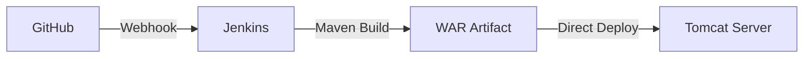
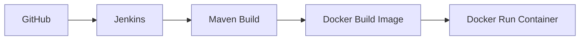
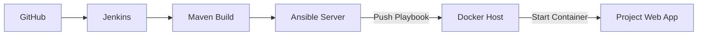

# 🗺️ Project Workflow Diagrams: High-Fidelity Views

This document contains the visual workflow diagrams for all stages of the DevOps project, styled to match the production environment visuals.

---

## 🏗️ Stage 1: Tomcat Server Flow
*Building and deploying standard WAR artifacts.*



---

## 📦 Stage 2: Docker Container Flow
*Containerizing the application for portability.*



---

## 🤖 Stage 3: Ansible Automation Flow
*Automated configuration and container management.*



---

## ☸️ Stage 4: Kubernetes Orchestration Flow
*The complete production-grade delivery pipeline.*

```mermaid
graph TD
    %% Styling for visual parity with screenshots
    classDef yellowSub fill:#fffbe6,stroke:#d4b106,stroke-width:1px;
    classDef purpleNode fill:#e6e6ff,stroke:#7d7db3,stroke-width:1px;

    subgraph Development [Development]
        style Development fill:#fffbe6,stroke:#d4b106
        A[Git Push]:::purpleNode --> B[GitHub]:::purpleNode
    end

    subgraph CIServer [CI Server (Jenkins)]
        style CIServer fill:#fffbe6,stroke:#d4b106
        B --> C[Jenkins Job]:::purpleNode
        C --> D[Maven Build]:::purpleNode
        D --> E[Archive Artifacts]:::purpleNode
    end

    subgraph Automation [Automation Hub (Ansible)]
        style Automation fill:#fffbe6,stroke:#d4b106
        E --> F[Ansible Playbook]:::purpleNode
        F --> G[Build Docker Image]:::purpleNode
        G --> H[Push to Docker Hub]:::purpleNode
        H --> I[Trigger K8s Apply]:::purpleNode
    end

    subgraph Production [Production (AWS EKS)]
        style Production fill:#fffbe6,stroke:#d4b106
        I --> J[EKS Cluster]:::purpleNode
        J --> K[ReplicaSet / Pods]:::purpleNode
        K --> L[Load Balancer]:::purpleNode
    end
```

---

> [!TIP]
> Use a Markdown viewer that supports **Mermaid.js** to see these diagrams rendered with the purple and yellow styling as shown in the project documentation screenshots.
