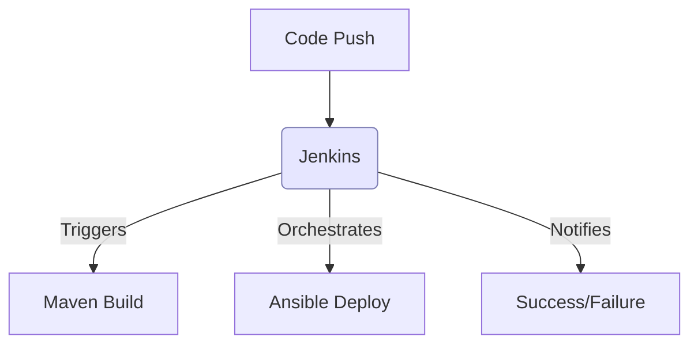
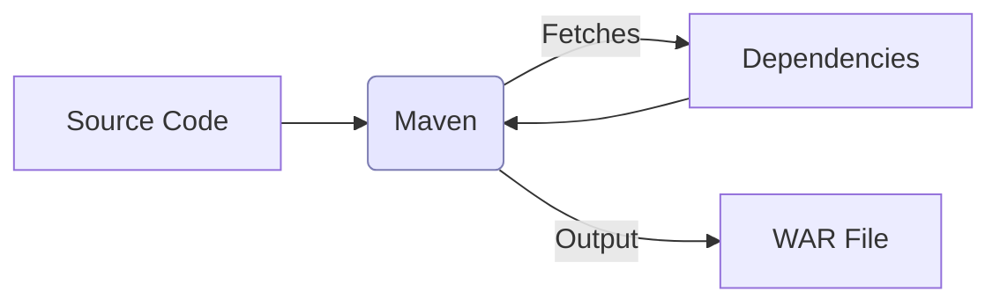
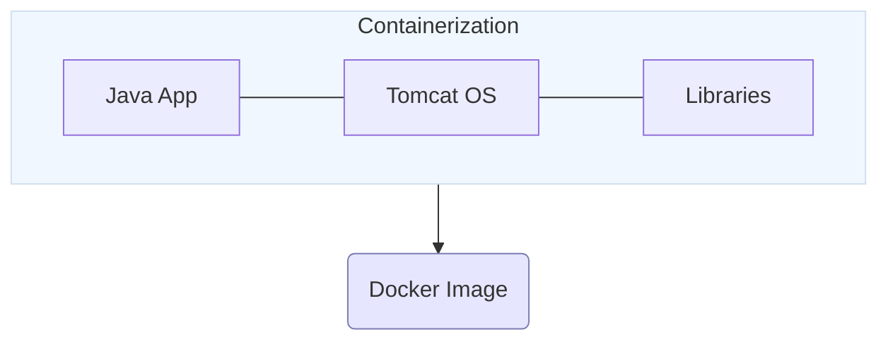
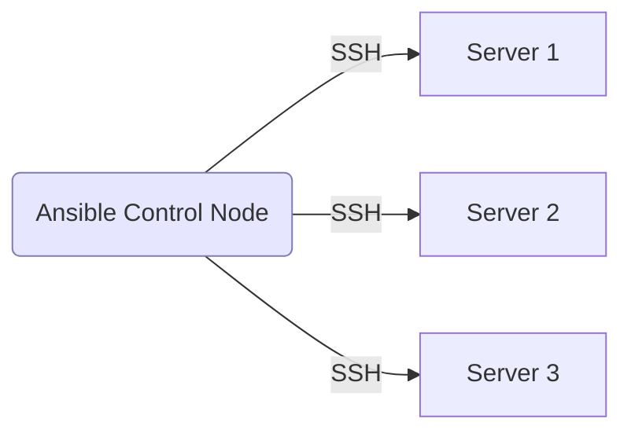

# 🧠 Tool Stack Deep Dive: Why & How We Use Them

This document explores the core technologies powering our DevOps pipeline, focusing on the strategic rationale and visual logic behind each choice.

---

## 🛠️ Jenkins: The Orchestrator
**Why use it?** Jenkins is the "brain" of our operation. It removes human error by automating the entire process from code commit to deployment.

**Diagram Art:**


---

## 🏗️ Maven: The Builder
**Why use it?** Java projects are complex projects with many dependencies. Maven standardizes the project structure and automates the creation of the `.war` artifact.

**Diagram Art:**


---

## 🐯 Tomcat: The Home for Code
**Why use it?** Our Java code needs a server that understands `.war` files. Tomcat provides the runtime environment to host our web application.

**Diagram Art:**


---

## 🐳 Docker: The Environment Box
**Why use it?** Docker solves the "it works on my machine" problem. It packages the code and the entire operating system environment into a single, portable image.

**Diagram Art:**


---

## 🤖 Ansible: The Automation Hand
**Why use it?** Instead of logging into 100 servers to run commands, we use Ansible. It uses "Playbooks" to ensure all servers are configured exactly the same way.

**Diagram Art:**


---

## ☸️ Kubernetes (EKS): The Manager
**Why use it?** Docker run containers, but Kubernetes manages them. If a container dies, K8s restarts it. If traffic grows, K8s scales it. It's the ultimate production-grade manager.

**Diagram Art:**
```mermaid
graph TD
    classDef main fill:#e6e6ff,stroke:#7d7db3;
    subgraph "K8s Cluster"
        style "K8s Cluster" fill:#f8fff8,stroke:#e0eee0
        A(Master Node):::main -->|Monitors| B[Worker Pods]
        B --> C[Service Load Balancer]
    end
```

---

> [!TIP]
> **Conclusion**: Each tool represents a layer of reliability. **Jenkins** starts the engine, **Maven** builds the parts, **Docker** boxes them up, **Ansible** delivers them, and **Kubernetes** keeps the lights on.

---
*Professional DevOps Architecture Documentation.*
